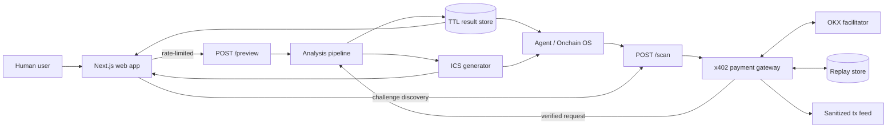
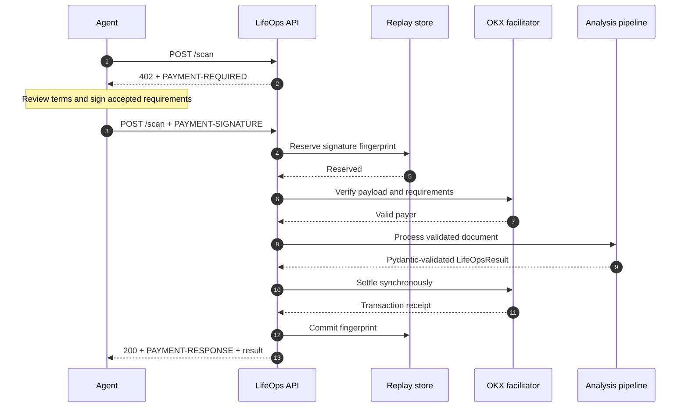
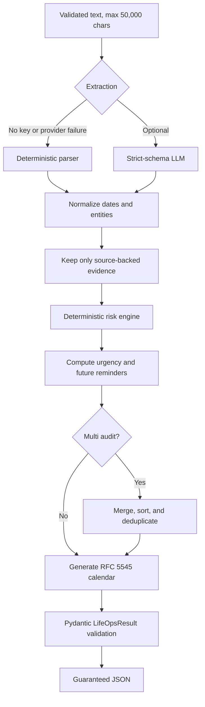

# LifeOps Architecture

This document describes the production architecture of LifeOps: the component boundaries, request paths, payment guarantees, data lifecycle, and operational tradeoffs behind the public web app and paid agent API.

For product positioning, live links, service pricing, and local setup, start with the [README](README.md).

## 1. System goals

LifeOps is designed around five invariants:

1. Every successful analysis conforms to `LifeOpsResult`.
2. Evidence quotes must exist in the submitted document.
3. Monetary exposure comes from deterministic rules or disclosed source values.
4. A paid response is returned only after x402 verification and settlement.
5. The human preview never claims that a payment occurred.

These constraints matter more than the extraction provider. The system remains useful without an LLM key and fails closed when the payment path is incomplete.

## 2. System context



There are two deliberate entry paths into the same analysis pipeline:

| Path | Consumer | Payment | Result claim |
|---|---|---|---|
| `POST /preview` | Human-facing web app | None | Explicitly marked `preview: true` |
| `POST /scan` | Agents and paid integrations | x402 v2 | Includes settled payment data and `PAYMENT-RESPONSE` |

The browser makes an unsigned `/scan` request only to read the standard 402 challenge for its protocol trace. It then uses `/preview`; it does not fabricate a payment signature.

## 3. Component boundaries

| Component | Responsibility | Does not own |
|---|---|---|
| Next.js frontend | Input, service selection, preview orchestration, protocol trace, results | Payment settlement or risk calculation |
| FastAPI application | HTTP contract, validation, rate limits, CORS, result URLs | Extraction policy or payment signing |
| Payment gateway | Challenge, signature decoding, facilitator verification, replay reservation, settlement | Document analysis |
| Extraction layer | Deterministic parsing with optional strict-schema LLM extraction | Final money values or API response validity |
| Pipeline | Normalization, date status, evidence filtering, aggregation, final schema validation | Transport and payment |
| Risk engine | Lead time, consequence, explainable exposure | Free-form model estimates |
| ICS generator | RFC 5545 calendar serialization | Result retention |
| Replay store | Prevent reuse of a payment signature | Transaction history |
| Result store | Short-lived result-to-calendar lookup | Durable user data |

## 4. Paid agent request



### Ordering guarantees

- Input validation happens before payment work for empty or invalid requests.
- A signature fingerprint is reserved before facilitator verification.
- Analysis runs only after verification succeeds.
- Settlement runs after analysis so a processing exception can release the reservation.
- The result is returned only after settlement succeeds.
- A settled fingerprint is committed and cannot be replayed.

If replay storage is unavailable, the paid endpoint returns an error instead of weakening replay protection.

## 5. Human preview request

The public interface optimizes for product evaluation, not wallet friction:

1. The frontend submits an unsigned `/scan` request.
2. FastAPI returns the standard x402 v2 challenge.
3. The UI exposes challenge details in the Protocol Proof surface.
4. The frontend submits the same document to rate-limited `/preview`.
5. The shared analysis pipeline produces the result.
6. The response is explicitly marked as a preview and contains no payment object.

This separation prevents two common integrity failures: a website pretending a preview was settled, and an agent endpoint silently bypassing payment.

## 6. Analysis pipeline



### Extraction

`backend/app/extract.py` supports deterministic extraction and optional LLM extraction. Provider failure falls back to deterministic logic rather than changing the response contract.

### Normalization

`backend/app/pipeline.py` owns the final semantics:

- unsupported document types become `unknown`;
- invalid deadlines are dropped and reported as warnings;
- `days_remaining` and `status` are recomputed from the normalized ISO date;
- reminders are parsed, deduplicated, sorted, and restricted to today or later;
- confidence is clamped to `0.0-1.0`;
- source evidence is discarded unless the quote occurs in the normalized input.

### Money at risk

`backend/app/money.py` owns monetary values. Category baselines provide conservative estimates; disclosed source values override them only for supported cases. Each obligation includes `risk_basis` and `money_at_risk_is_estimate` so consumers can distinguish an estimate from a document-backed amount.

### Multi-document audit

Documents are split on explicit separators such as `---`, processed independently, and merged. Obligations are urgency-sorted, reminders are deduplicated, risk is summed, and the lowest document confidence becomes the aggregate confidence.

## 7. Data model

The public contract is `LifeOpsResult` in `backend/app/schema.py`.

| Field | Guarantee |
|---|---|
| `document_type` | Supported enum, including `multi` and `unknown` |
| `entities` | Stable object with nullable normalized fields |
| `obligations` | Valid ISO deadlines with status, steps, and risk basis |
| `reminders` | Sorted, unique, non-past ISO dates |
| `total_money_at_risk_usd` | Sum of normalized obligations |
| `confidence` | Number between 0 and 1 |
| `evidence` | Quotes traceable to the submitted text |
| `warnings` | Non-fatal normalization issues |
| `extraction_mode` | `deterministic`, `llm`, or `hybrid` |
| `ics_base64` | RFC 5545 calendar payload when requested and applicable |

## 8. Storage and lifecycle

LifeOps intentionally avoids a user-document database.

### Result store

- In-process bounded LRU map.
- Maximum 200 results per instance.
- Default TTL: 30 minutes.
- Stores generated results only to support per-result `.ics` downloads.
- A restart or instance replacement clears the store.

### Replay store

- Upstash Redis in the production topology.
- Persistent SQLite is supported when the host provides a mounted disk.
- Stores payment fingerprints and reservation state, not document contents.
- Production readiness is false when replay protection is not persistent.

### Transaction feed

- Keeps a bounded recent in-process feed.
- Removes `payer` and `caller` before public output.
- Filters the frontend feed to real `x402` entries.
- Is operational proof, not an accounting ledger.

## 9. Security and trust boundaries

| Boundary | Control |
|---|---|
| Public input -> API | Pydantic validation, 50,000-character field limit, 64 KiB request limit |
| Browser -> preview | Per-client rate limiting and configurable preview disable switch |
| Agent -> paid route | x402 v2 signature, exact requirement match, facilitator verification |
| Payment reuse | Reserve/commit replay state keyed by signature fingerprint |
| API -> browser | Explicit CORS allowlist and exposed payment headers |
| Evidence -> result | Exact normalized source-text membership check |
| Secrets -> runtime | Deployment secret store; no production values in the repository |
| Public tx feed | Payer and caller removed before serialization |

The middleware also emits request IDs, disables MIME sniffing, sets a no-referrer policy, blocks framing through CSP, and enables HSTS on HTTPS requests.

## 10. Failure behavior

| Failure | Behavior |
|---|---|
| Missing payment signature | `402 payment_required` plus challenge headers |
| Legacy `X-Payment` in production | Rejected; v2 `PAYMENT-SIGNATURE` is required |
| Requirement mismatch | `402 payment_requirements_mismatch` |
| Replayed payment | `409 payment_replayed` |
| Facilitator unavailable | Paid route fails closed |
| Replay store unavailable | Paid route fails closed |
| Extraction provider failure | Deterministic extraction fallback |
| Invalid deadline | Obligation omitted, warning retained |
| Settlement failure | No business result returned |
| Missing or expired result ID | Calendar endpoint returns `404` |

## 11. Deployment topology

| Layer | Production service | State |
|---|---|---|
| Frontend | Vercel / Next.js | Stateless |
| API | Render / FastAPI container | Stateless except bounded in-process caches |
| Replay protection | Upstash Redis | Persistent |
| Payment verification | OKX facilitator | External trusted service |
| Settlement | USDT0 on X Layer | On-chain source of truth |
| Optional extraction | OpenAI API | Replaceable enhancement |

`render.yaml` defines the API and an alternate frontend deployment. `frontend/vercel.json` defines the current Next.js deployment. `NEXT_PUBLIC_API_BASE` is the only browser-to-API binding.

## 12. Readiness contract

`GET /health` exposes the conditions required for production agent commerce:

```json
{
  "status": "ok",
  "ready_for_listing": true,
  "payto_configured": true,
  "facilitator_configured": true,
  "replay_persistent": true,
  "demo_mode": false,
  "network": "eip155:196"
}
```

`ready_for_listing` is derived, not manually configured. It becomes true only when every payment and replay requirement is satisfied.

## 13. Deliberate tradeoffs

- **No durable document database:** reduces privacy surface, but calendar links are temporary.
- **Deterministic fallback:** preserves availability and schema guarantees, but may extract fewer nuanced fields than the LLM path.
- **Synchronous settlement:** gives callers an authoritative receipt, but adds facilitator latency to paid calls.
- **Separate preview route:** improves evaluation UX, but the web experience is not itself a paid x402 client.
- **In-memory transaction feed:** useful for live proof, but intentionally not a financial ledger.

## 14. Extension points

The current boundaries allow the following additions without rewriting the core pipeline:

- an optional wallet-connected paid web mode that creates `PAYMENT-SIGNATURE`;
- OCR or image ingestion before text validation;
- durable encrypted result storage behind an explicit user consent boundary;
- additional document-type risk profiles;
- async callbacks for long-running multi-document audits;
- observability exporters keyed by `X-Request-ID`.

Any extension must preserve the five invariants at the top of this document.

