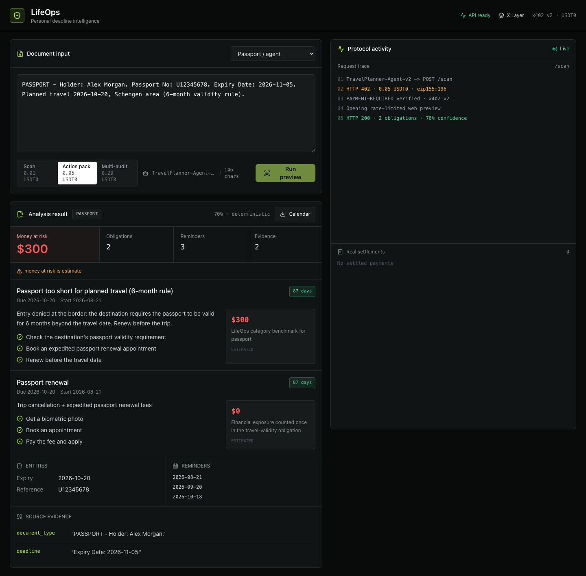

# LifeOps

Personal documents become deadlines, conservative money-at-risk estimates, evidence-backed action plans, and calendar events in one API call.

LifeOps is an agent-consumable ASP for the OKX.AI Lifestyle Companion category. Paid calls settle in USDT0 on X Layer through x402 v2 and the official OKX Payments SDK.

## Submission status

| Proof | Status |
|---|---|
| Public web app | [Live on Vercel](https://life-ops-web1.vercel.app/) |
| Public API | [Live and listing-ready](https://lifeops-75gx.onrender.com/health) |
| OKX.AI ASP ID | `#9204` |
| Real settlement tx | [Confirmed on X Layer](https://www.oklink.com/x-layer/tx/0xb8d39f8425bc4ae8ba1d846aacf3b9fcd5868799d5356c8534f5d72f06971d75) |
| Marketplace listing | Submitted for review |

Operational proof is tracked in [SUBMISSION.md](SUBMISSION.md). Nothing in this table is marked complete until it has a public, verifiable link.

## Live workspace

[](https://life-ops-web1.vercel.app/)

## What makes it different

- Guaranteed Pydantic output, never free-form prose.
- Source evidence quotes for every detected field.
- Conservative, explainable `money_at_risk_usd` with a `risk_basis` and estimate flag.
- Correct overdue/upcoming state, future-only reminders, and RFC 5545 calendar output.
- Multi-document audit merges personal obligations into one urgency-sorted calendar.
- Real x402 v2 verify and synchronous settle through OKX on X Layer.
- Replay protection persists across instances and restarts through Upstash Redis or mounted SQLite.

No deadline is fabricated when the document does not contain one. The deterministic fallback remains schema-safe without an LLM key.

## Services

| Service | Price | Output |
|---|---:|---|
| `scan` | 0.01 USDT0 | Type, entities, deadline, evidence, risk |
| `full_action_pack` | 0.05 USDT0 | Scan plus steps, reminders, and per-result `.ics` |
| `multi_audit` | 0.20 USDT0 | Merged obligations, total risk, one combined `.ics` |

All paid services use `POST /scan`; the request `service` field selects the price and pipeline.

## Architecture

```text
Agent / Onchain OS
  -> POST /scan
  <- 402 + PAYMENT-REQUIRED (x402 v2)
  -> PAYMENT-SIGNATURE
  -> OKX facilitator verify
  -> extraction + deterministic risk + evidence + calendar
  -> OKX facilitator settle
  <- 200 + PAYMENT-RESPONSE + guaranteed JSON

Human web app
  -> rate-limited POST /preview
  <- the same analysis pipeline, without a settlement claim
```

The frontend never sends a demo payment and the public transaction feed filters out local demo entries.

## Run locally

Backend:

```bash
cd backend
bash run.sh
```

Frontend:

```bash
cd frontend
npm install
npm run dev
```

Open `http://localhost:3000`. The web preview works without payment credentials. Production `/scan` fails closed until all payment settings are present.

## Production configuration

Required for `ready_for_listing: true`:

```text
LIFEOPS_PAYTO=0x...                       # receiving X Layer wallet
OKX_API_KEY=...                           # OKX facilitator HMAC credential
OKX_SECRET_KEY=...
OKX_PASSPHRASE=...
UPSTASH_REDIS_REST_URL=...                # free persistent replay store
UPSTASH_REDIS_REST_TOKEN=...
LIFEOPS_DEMO_MODE=false
LIFEOPS_CORS_ORIGINS=https://your-web-app.example
```

Optional:

```text
OPENAI_API_KEY=...                        # strict JSON-schema extraction
LIFEOPS_MODEL=gpt-4o-mini
LIFEOPS_PREVIEW_ENABLED=true
LIFEOPS_RATE_LIMIT_PER_MINUTE=60
LIFEOPS_RESULT_TTL_SECONDS=1800
NEXT_PUBLIC_API_BASE=https://your-api.example
```

`render.yaml` defines the API, free-tier persistent replay store, and frontend. Secret values are never stored in the repository.

`LIFEOPS_REPLAY_DB=/var/data/replays.db` remains available when the host provides a persistent mounted disk.

## API

| Method | Endpoint | Purpose |
|---|---|---|
| `GET` | `/health` | Payment and listing readiness |
| `GET` | `/pricing` | Service requirements and prices |
| `POST` | `/scan` | Paid x402 v2 analysis |
| `POST` | `/preview` | Rate-limited human preview |
| `GET` | `/tx` | Settled payment log |
| `GET` | `/ics/{result_id}.ics` | TTL-bound calendar download |

Request:

```json
{
  "text": "Your StreamPlus trial ends in 3 days and converts to 19.99 USD per month.",
  "service": "full_action_pack",
  "caller": "TravelPlanner-Agent-v2"
}
```

An unpaid `/scan` returns a base64 `PAYMENT-REQUIRED` header containing:

```json
{
  "x402Version": 2,
  "resource": { "url": "https://api.example/scan", "mimeType": "application/json" },
  "accepts": [{
    "scheme": "exact",
    "network": "eip155:196",
    "asset": "0x779ded0c9e1022225f8e0630b35a9b54be713736",
    "amount": "50000",
    "payTo": "0x...",
    "maxTimeoutSeconds": 60,
    "extra": { "name": "USD₮0", "version": "1" }
  }]
}
```

The retry must use `PAYMENT-SIGNATURE`. A successful response includes the real facilitator receipt in `PAYMENT-RESPONSE`.

## Verification

```bash
PYTHONPATH=backend .venv/bin/pytest -q backend/tests backend/test_smoke.py
cd frontend && npm run typecheck && npm run build && npm audit
```

Current local baseline: 24 backend tests pass, frontend production build passes, and npm reports zero known vulnerabilities.

## Real agent-to-agent demo

After wallet login, funding, and public deployment:

```bash
LIFEOPS_API_BASE=https://your-api.example python backend/agent_call_demo.py
```

The script uses the official two-phase Onchain OS flow: quote, explicit human confirmation, TEE signature, merchant retry, decoded receipt, tx hash, and LifeOps JSON. It contains no private key and never auto-confirms a payment.
