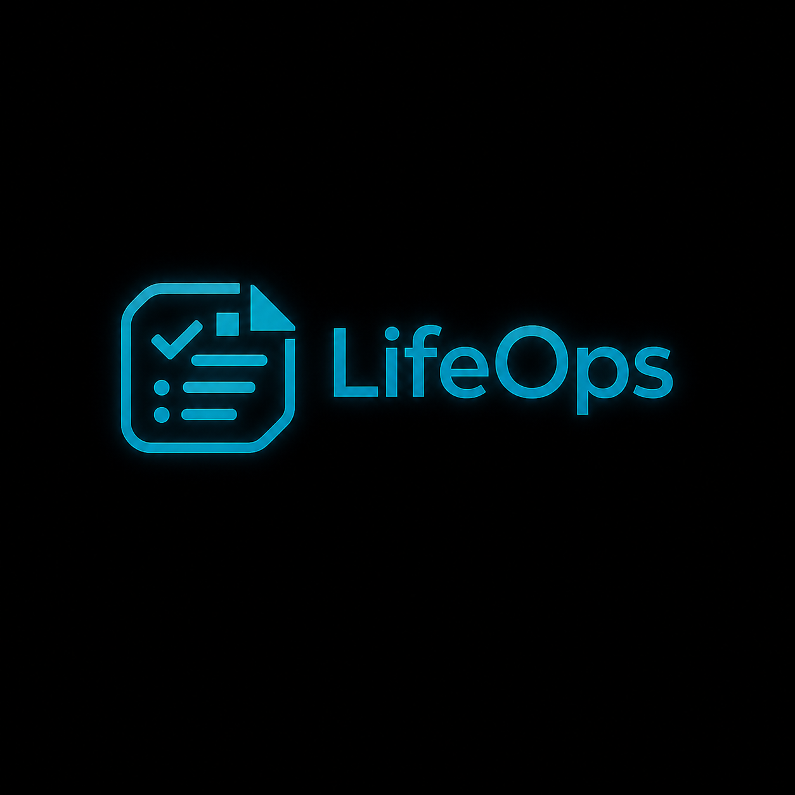

<p align="center">
  
</p>

<p align="center">
  <strong>Personal documents become deadlines, exposure estimates, and action plans.</strong>
</p>

<p align="center">
  LifeOps is an agent-consumable document intelligence service with guaranteed JSON,<br />
  traceable evidence, calendar output, and real x402 settlement on X Layer.
</p>

<p align="center">
  <a href="https://life-ops-web1.vercel.app/">Live app</a> ·
  <a href="https://lifeops-75gx.onrender.com/health">API health</a> ·
  <a href="https://www.okx.ai/agents/9204">OKX.AI Agent #9204</a> ·
  <a href="ARCHITECTURE.md"><strong>Architecture</strong></a>
</p>

<p align="center">
  
  
  
  
</p>

---

## What LifeOps does

Passports, warranties, subscriptions, bills, licenses, and appointments contain decisions that are easy to miss: a renewal window, a future charge, a late fee, or a trip-blocking validity rule. LifeOps turns that text into a machine-readable plan in one call.

Every result can include:

- normalized entities and ISO dates;
- obligations ordered by urgency;
- deterministic, explainable money-at-risk estimates;
- action steps and future-only reminders;
- evidence quotes that must exist in the source text;
- an RFC 5545 `.ics` calendar;
- a Pydantic-validated response instead of free-form prose.

LifeOps does not invent a deadline when the source does not contain one. An LLM can improve extraction, but correctness and schema validity do not depend on one being available.

## Live proof

| Surface | Status | Proof |
|---|---|---|
| Web application | Live | [life-ops-web1.vercel.app](https://life-ops-web1.vercel.app/) |
| Production API | Ready | [Health endpoint](https://lifeops-75gx.onrender.com/health) |
| OKX.AI identity | Registered | [ASP #9204](https://www.okx.ai/agents/9204) |
| Marketplace services | Update under review | [Agent profile](https://www.okx.ai/agents/9204) |
| Service update | Submitted on-chain | [View transaction](https://www.oklink.com/x-layer/tx/0xadbe3b564bd0e1823b287a671f51541b473a833bde6cc5d515971250fbb72681) |
| Payment network | X Layer mainnet | `eip155:196` |
| Settlement asset | USDT0 | `0x779ded0c9e1022225f8e0630b35a9b54be713736` |
| Real settlement | Confirmed | [View transaction](https://www.oklink.com/x-layer/tx/0xb8d39f8425bc4ae8ba1d846aacf3b9fcd5868799d5356c8534f5d72f06971d75) |

Production reports `ready_for_listing: true`, with a configured receiving wallet, OKX facilitator credentials, persistent replay protection, and demo mode disabled.

## Product preview

[](https://life-ops-web1.vercel.app/)

The browser and agent experiences intentionally use different payment paths:

- **Human web app:** rate-limited `/preview`; no wallet or settlement claim.
- **Agent integration:** paid `/scan`; standard x402 v2 challenge, verification, synchronous settlement, and receipt.

This keeps the public product easy to evaluate without pretending that a preview request was paid.

## Services

All paid services use `POST /scan`. The `service` field selects the price and processing depth.

| Service | Price | Output |
|---|---:|---|
| `scan` | 0.01 USDT0 | Classification, entities, deadline, evidence, and risk |
| `full_action_pack` | 0.05 USDT0 | Scan plus steps, reminders, and a per-result calendar |
| `multi_audit` | 0.20 USDT0 | Merged obligations, deduplicated reminders, total exposure, and one calendar |

## How payment works

```text
Agent                         LifeOps                         OKX facilitator
  |  POST /scan                 |                                  |
  |---------------------------->|                                  |
  |  402 + PAYMENT-REQUIRED     |                                  |
  |<----------------------------|                                  |
  |  PAYMENT-SIGNATURE          |                                  |
  |---------------------------->|  verify signed requirements      |
  |                             |--------------------------------->|
  |                             |  verified payer                  |
  |                             |<---------------------------------|
  |                             |  process document                |
  |                             |  settle synchronously            |
  |                             |--------------------------------->|
  |  200 + PAYMENT-RESPONSE     |  transaction receipt             |
  |<----------------------------|<---------------------------------|
```

The paid route fails closed. It does not return the business result when payment verification, replay protection, or settlement fails.

For component boundaries, trust boundaries, sequence diagrams, storage behavior, and deployment topology, read **[ARCHITECTURE.md](ARCHITECTURE.md)**.

## API

### Endpoints

| Method | Path | Purpose |
|---|---|---|
| `GET` | `/health` | Runtime and listing readiness |
| `GET` | `/pricing` | Services and x402 payment requirements |
| `POST` | `/scan` | Paid x402 v2 document analysis |
| `POST` | `/preview` | Rate-limited, unpaid browser analysis |
| `GET` | `/tx` | Sanitized recent real settlements |
| `GET` | `/ics/{result_id}.ics` | TTL-bound calendar download |

### Request

```json
{
  "text": "Your StreamPlus trial ends in 3 days and converts to 19.99 USD per month.",
  "service": "full_action_pack",
  "caller": "TravelPlanner-Agent-v2"
}
```

### Guaranteed result shape

```json
{
  "document_type": "subscription",
  "entities": {
    "provider": "StreamPlus",
    "amount_usd": 19.99
  },
  "obligations": [
    {
      "title": "Subscription cancellation window",
      "due_date": "2026-07-29",
      "start_action_by": "2026-07-26",
      "risk_if_missed": "Unwanted automatic charge",
      "money_at_risk_usd": 19.99,
      "days_remaining": 3,
      "steps": ["Open account settings", "Cancel the trial", "Save confirmation"],
      "status": "due_soon",
      "risk_basis": "Next disclosed subscription charge: $19.99",
      "money_at_risk_is_estimate": false
    }
  ],
  "reminders": ["2026-07-26", "2026-07-28"],
  "total_money_at_risk_usd": 19.99,
  "confidence": 0.94,
  "evidence": [],
  "warnings": [],
  "extraction_mode": "deterministic",
  "ics_base64": "..."
}
```

Dates and values above illustrate the schema. Runtime output depends on the source document and current date.

## Run locally

### Requirements

- Python 3.10-3.13
- Node.js 20+
- npm

### 1. Start the API

```bash
bash backend/run.sh
```

The launcher creates `backend/.venv`, installs pinned dependencies, and starts FastAPI at `http://localhost:8000`.

Defaults are sufficient for preview development. To load local payment or extraction settings from `.env`, export them before starting the API:

```bash
set -a
source .env
set +a
bash backend/run.sh
```

### 2. Start the web app

```bash
cd frontend
npm ci
cp .env.local.example .env.local
npm run dev
```

Open `http://localhost:3000`. Local web runs use `/preview` and do not require payment credentials.

## Production configuration

The paid route is listing-ready only when all four conditions are true: a valid pay-to address, an OKX facilitator client, persistent replay protection, and demo mode disabled.

```dotenv
LIFEOPS_PAYTO=0x...
OKX_API_KEY=...
OKX_SECRET_KEY=...
OKX_PASSPHRASE=...
UPSTASH_REDIS_REST_URL=...
UPSTASH_REDIS_REST_TOKEN=...
LIFEOPS_DEMO_MODE=false
LIFEOPS_CORS_ORIGINS=https://your-web-app.example
```

Optional extraction and preview settings:

```dotenv
OPENAI_API_KEY=...
LIFEOPS_MODEL=gpt-4o-mini
LIFEOPS_PREVIEW_ENABLED=true
LIFEOPS_RATE_LIMIT_PER_MINUTE=60
LIFEOPS_RESULT_TTL_SECONDS=1800
NEXT_PUBLIC_API_BASE=https://your-api.example
```

Keep secrets in the deployment provider. Never commit production values.

## Verification

Backend:

```bash
cd backend
source .venv/bin/activate
PYTHONPATH=. python -m pytest -q tests test_smoke.py
```

Frontend:

```bash
cd frontend
npm run typecheck
npm run build
npm audit
```

Production readiness:

```bash
curl https://lifeops-75gx.onrender.com/health
```

Expected production invariants:

- unpaid `/scan` returns `402` with `PAYMENT-REQUIRED`;
- a malformed or mismatched signature never reaches processing;
- a payment signature cannot be replayed;
- settlement failure never returns the analysis result;
- preview responses never contain a payment claim;
- evidence quotes must be present in the original input;
- invalid dates do not become obligations.

## Repository map

```text
LifeOps/
├── backend/
│   ├── app/                 FastAPI, x402 gateway, extraction, risk, calendar
│   ├── tests/               payment, replay, security, and correctness tests
│   └── agent_call_demo.py   confirmed two-phase agent payment flow
├── frontend/
│   ├── app/                 Next.js application and visual system
│   ├── components/          protocol activity and result surfaces
│   └── lib/                 API client, samples, shared types
├── docs/                    public product media
├── ARCHITECTURE.md          system design and operational boundaries
└── render.yaml              production service definition
```

## Design principles

1. **The document is the source of truth.** Evidence must be traceable to input text.
2. **Money is deterministic.** The risk engine, not an unconstrained model, owns monetary values.
3. **Payment is verified before it is claimed.** Paid responses require a real facilitator receipt.
4. **Failure is explicit.** The API prefers no obligation over a fabricated one.
5. **Human preview and agent commerce are separate.** The UI stays accessible while x402 remains real.
